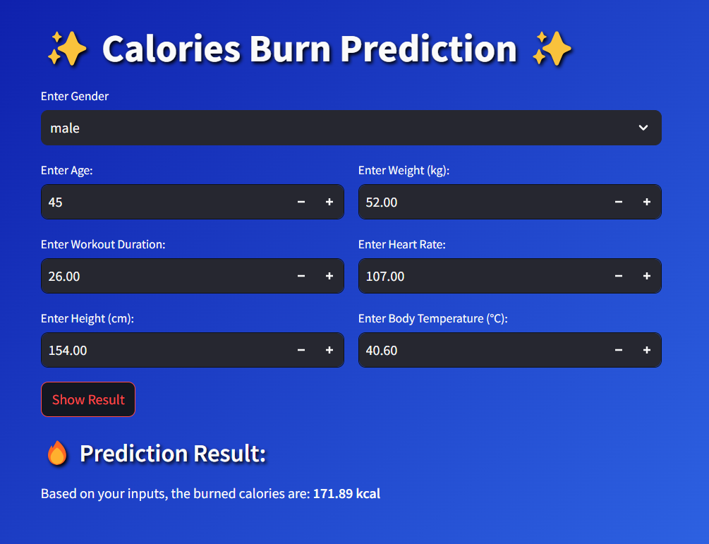

# Calories Burnt Prediction 
## Install the libraries
In your virtual environment using conda command:
```shell
conda install --file requirements.txt
```
## Do the eda and save the model
Use this model to make prediction

## Run the app
By following command
```shell
streamlit run main.py
```
